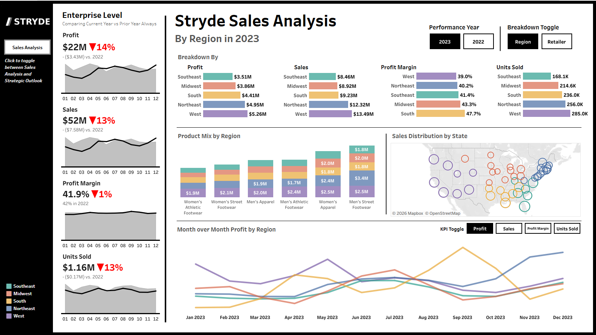
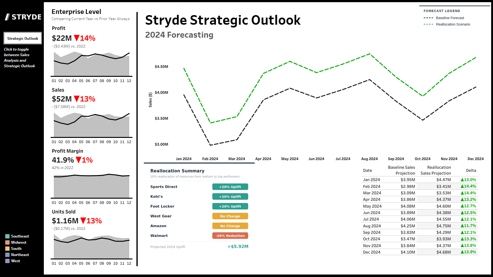
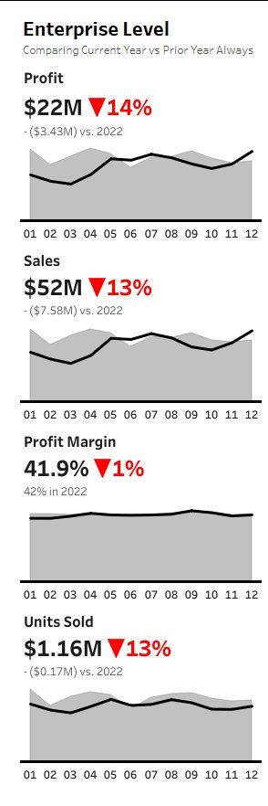
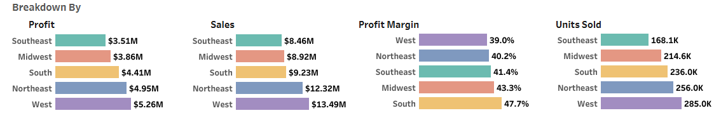
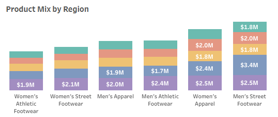
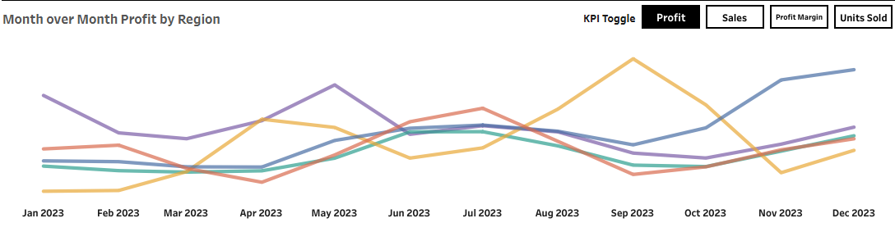
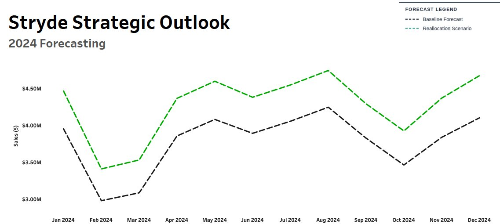

<p align="center">
  
</p>

# Stryde Sales Analysis & Strategic Outlook

 &nbsp;  &nbsp;  &nbsp; 

---

## Background

| | |
|---|---|
| **About Stryde** | Stryde is a US sportswear brand selling athletic and street footwear and apparel across five regions (Southeast, Midwest, South, Northeast, and West) through six retail partners: Foot Locker, Kohl's, Sports Direct, West Gear, Amazon, and Walmart, across in-store, outlet, and online channels. |
| **The Ask** | The Head of Operations needed a clear picture of where the business stood after two years of post-pandemic normalization. I was tasked with evaluating performance from 2022 to 2023, identifying what was actually driving the numbers, and building a 2024 forecast. That forecast included a scenario modeling the impact of pulling resources from the weakest retail partners and putting them behind the strongest ones. |

The work broke down into four areas: enterprise-level KPIs, regional performance, product mix, and the 2024 forecast.

---

## Dashboard

> GitHub doesn't support iframe embeds, so Tableau dashboards can't render inline. The standard workaround is to publish to [Tableau Public](https://public.tableau.com), take a screenshot, and link the image so clicking it opens the live, interactive version.

[](https://public.tableau.com/YOUR_DASHBOARD_LINK_HERE)
[](https://public.tableau.com/YOUR_DASHBOARD_LINK_HERE)

> To set this up: drop your screenshots in an `/images` folder and swap in your Tableau Public URL above.

---

## Data

Two tables. The sales dataset covers every transaction from January 2022 through December 2023: retailer, date, region, state, city, product, price, units, revenue, profit, margin, and sales channel. The forecast table holds the monthly 2024 projections for both the baseline and reallocation scenarios.

| File | What's in it |
|---|---|
| `Stryde_US_Sales_Dataset.csv` | Transaction-level sales data, 2022 to 2023 |
| `stryde_forecast_scenarios.csv` | Monthly 2024 forecast, baseline vs. reallocation |

---

## Executive Summary

Stryde finished 2023 down across the board. Sales came in at $52M and profit at $22M, both off roughly 13 to 14% from 2022. Units sold dropped at the same rate, and margin barely moved (42% to 41.9%).

<p align="center">
  
</p>

| KPI | 2023 | vs. 2022 |
|---|---|---|
| Profit | $22M | -14% (-$3.43M) |
| Sales | $52M | -13% (-$7.58M) |
| Profit Margin | 41.9% | -1pt |
| Units Sold | 1.16M | -13% (-0.17M) |

The fact that margin stayed basically flat while revenue and units both fell tells you something: this isn't a pricing problem or a cost problem. Stryde is just selling less. The economics of individual transactions are fine. There are just fewer of them.

---

## What the Data Showed

### Regional Performance

<p align="center">
  
</p>

| Region | Sales | Profit | Margin | Units Sold |
|---|---|---|---|---|
| West | $13.49M | $5.26M | 39.0% | 285.0K |
| Northeast | $12.32M | $4.95M | 40.2% | 256.0K |
| South | $9.23M | $4.41M | 47.7% | 236.0K |
| Midwest | $8.92M | $3.86M | 43.3% | 214.6K |
| Southeast | $8.46M | $3.51M | 41.4% | 168.1K |

The West and Northeast lead on volume, together accounting for about half of total company sales. The more interesting finding is the South. It ranks third in revenue but has by far the best margin at 47.7%, nearly 9 points ahead of the West. The South isn't Stryde's biggest market, but it's the most profitable one.

The Southeast is worth flagging as a concern. It's last in both sales and units, and its month-to-month numbers are the most erratic of any region. Before writing it off, it's worth understanding whether the issue is the retailer mix there, the product assortment, or just lower brand awareness.

---

### Product Mix by Region

<p align="center">
  
</p>

| Product | Strongest Region |
|---|---|
| Men's Street Footwear | West |
| Women's Apparel | West / South |
| Men's Athletic Footwear | Northeast |
| Men's Apparel | Midwest / South |
| Women's Street Footwear | Distributed evenly |
| Women's Athletic Footwear | Southeast |

Men's Street Footwear is the highest-revenue category, anchored by the West. One thing that stood out: Women's Athletic Footwear is heavily concentrated in the Southeast, which is Stryde's weakest region. That category is probably underexposed in markets where the brand is already doing well, and there's a real opportunity to push it into the West and Northeast.

Overall, no single category is running away from the others. The mix is pretty balanced, which means there isn't one breakout product carrying the company right now.

---

### Month-over-Month Trends

<p align="center">
  
</p>

The South and West showed the sharpest seasonal swings, with peaks mid-year and again in Q4 and softer stretches in between. The Northeast and Midwest move together pretty closely, which makes sense given similar consumer profiles. The Southeast is the outlier: inconsistent month to month, no clear pattern, and the hardest to plan around.

---

## 2024 Forecast

### How It Was Built

I used Python (Pandas + Scikit-learn) to build a time-series regression model on the 2022 to 2023 monthly sales data. The model captures seasonality and trend to project month-by-month sales through 2024. That's the baseline.

The reallocation scenario asks a simple question: if Stryde took 20% of the budget currently going to Walmart and put it behind the three top-performing retailers, how much would that move the needle?

<p align="center">
  
</p>

### Reallocation Logic

<p align="center">
  
</p>

| Retailer | Change | Why |
|---|---|---|
| Sports Direct | +20% | Top performer |
| Kohl's | +20% | Top performer |
| Foot Locker | +20% | Top performer |
| West Gear | No change | Holding steady |
| Amazon | No change | Holding steady |
| Walmart | -20% | Lowest performer |

### Results

| Month | Baseline | Reallocation | Difference |
|---|---|---|---|
| Jan 2024 | $3.95M | $4.47M | +13.0% |
| Feb 2024 | $2.98M | $3.41M | +14.4% |
| Mar 2024 | $3.09M | $3.53M | +14.4% |
| Apr 2024 | $3.86M | $4.37M | +13.2% |
| May 2024 | $4.08M | $4.60M | +12.7% |
| Jun 2024 | $3.89M | $4.38M | +12.5% |
| Jul 2024 | $4.06M | $4.55M | +12.1% |
| Aug 2024 | $4.25M | $4.75M | +11.7% |
| Sep 2024 | $3.83M | $4.29M | +12.1% |
| Oct 2024 | $3.47M | $3.93M | +13.3% |
| Nov 2024 | $3.84M | $4.37M | +13.8% |
| Dec 2024 | $4.10M | $4.68M | +13.9% |
| **Full Year** | **~$45.4M** | **~$51.3M** | **+$5.92M** |

A ~$6M lift from a reallocation. No new budget, no new products, no new markets. Just moving money from where it's not working to where it is.

---

## Recommendations

**Lean into the South.** The margin numbers there are too good to leave on the table. If Stryde can grow volume in the South without giving up that efficiency, it improves the whole company's profitability, not just one region's revenue line.

**Figure out what's happening in the Southeast before pulling back.** The numbers are bad, but the cause isn't obvious from the data alone. Is Walmart the dominant retailer there? Is the product mix wrong? Worth understanding before writing off the region.

**Shift resources away from Walmart.** The forecast makes a clear case for it. A 20% reallocation from Walmart to Sports Direct, Kohl's, and Foot Locker is projected to add nearly $6M in 2024 sales with no new spend.

**Take a closer look at Amazon.** It's holding steady but not growing. Given Amazon's fee structure, flat revenue can quietly mean shrinking margin. Worth running the numbers on what the channel is actually worth net of fees.

**Push Women's Athletic Footwear into stronger markets.** Right now it's concentrated in the Southeast, where Stryde has the least traction. This category likely has more potential than the current numbers show. It just needs exposure in regions where the brand is already winning.

---

## Repo Structure

```
Stryde_Sales_Analysis/
│
├── README.md
├── Stryde_EDA_and_Forecasting.ipynb
│
├── data/
│   ├── Stryde_US_Sales_Dataset.csv
│   └── stryde_forecast_scenarios.csv
│
└── images/
    ├── stryde_logo.png
    ├── stryde_sales_analysis.png
    ├── stryde_strategic_outlook.png
    ├── regional_breakdown.png
    ├── product_mix.png
    ├── mom_trends.png
    ├── forecast_chart.png
    └── reallocation_summary.png
```

---

*[Your Name] &nbsp;|&nbsp; [LinkedIn](https://linkedin.com/in/your-profile) &nbsp;|&nbsp; [Portfolio](https://yoursite.com)*
